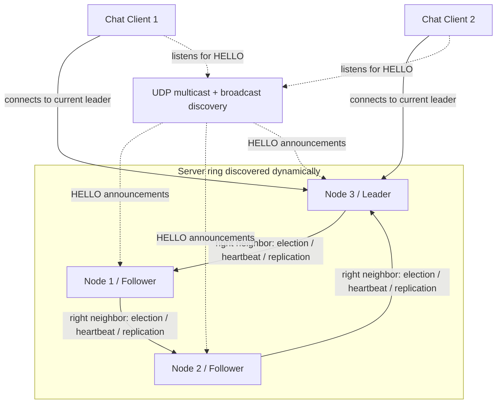

# Distributed Chat System - Demo Version

This is the simple demo version for the Distributed Systems project.
It is built to demonstrate exactly the required project criteria:

- Dynamic discovery of hosts
- Crash fault tolerance
- Election with ring left/right communication
- At least two physical machines for the demo
- Clear architecture explanation

## Files

- `ds_node.py` = server node
- `ds_client.py` = chat client

No external Python packages are needed.


## Voting / Leader Election (matches our project form)

Our project form says: leader election is based on unique server node IDs. When the current leader becomes unavailable, the active node with the highest ID becomes the new leader.

This demo implements exactly that rule, but the election message is still passed through the server ring. So we satisfy both ideas:

- the winner is the highest active server node ID
- the election is demonstrated with ring/right-neighbor communication

Example:

- Active nodes: 1, 2, 3 -> Leader = 3
- Node 3 crashes -> Active nodes: 1, 2 -> New Leader = 2
- Node 2 crashes -> Active node: 1 -> New Leader = 1

## Architecture



## Local test on one laptop

Open 4 terminals in the same folder.

Terminal 1:

```powershell
py ds_node.py --id 1
```

Terminal 2:

```powershell
py ds_node.py --id 2
```

Terminal 3:

```powershell
py ds_node.py --id 3
```

Terminal 4:

```powershell
py ds_client.py
```

Expected result:

- Nodes discover each other.
- Ring becomes `1 -> 2 -> 3`.
- Node 3 becomes leader.
- Client connects to leader Node 3.
- Chat messages are sent through Node 3.

## Demo on two physical machines

Use one shared phone hotspot if university Wi-Fi blocks multicast/broadcast.

### Laptop A

Terminal 1:

```powershell
py ds_node.py --id 1
```

Terminal 2:

```powershell
py ds_node.py --id 2
```

Terminal 3:

```powershell
py ds_client.py
```

### Laptop B

Terminal 1:

```powershell
py ds_node.py --id 3
```

Terminal 2:

```powershell
py ds_client.py
```

## Windows firewall rules

Run PowerShell as Administrator on both laptops:

```powershell
New-NetFirewallRule -DisplayName "DS Chat TCP" -Direction Inbound -Protocol TCP -LocalPort 6001-6010,7001-7010 -Action Allow
New-NetFirewallRule -DisplayName "DS Chat UDP Discovery" -Direction Inbound -Protocol UDP -LocalPort 50000 -Action Allow
```

## What to show in the demo

1. Start Node 1, Node 2, Node 3.
2. Show discovery logs: `DISCOVERY found node ...`.
3. Show ring status: `ring=[1 -> 2 -> 3]`.
4. Show leader election: `I AM LEADER` on Node 3.
5. Start two clients and send messages.
6. Kill Node 3 with `Ctrl + C`.
7. Show crash detection: `CRASH DETECTED`.
8. Show new election.
9. Show Node 2 becoming leader.
10. Show clients reconnecting automatically.

## Explanation text

Our project is a distributed chat system. Several server nodes discover each other dynamically using UDP multicast and broadcast. From the discovered nodes, each server builds the same logical ring ordered by node ID.

The leader election uses ring communication. When an election starts, a node sends an election message only to its right neighbor. The message travels through the ring. The highest active node ID wins. When the winning node receives its own ID again, it declares itself leader and sends a leader announcement through the ring.

Only the leader accepts chat clients. Followers reject clients with `NOT_LEADER`, so the client keeps searching until it reaches the leader. The leader receives chat messages and broadcasts them to connected clients.

For crash fault tolerance, the leader sends heartbeat messages through the ring. If followers stop receiving heartbeats, they assume that the leader crashed and start a new election. The client notices the broken connection and automatically reconnects to the new leader.

## Important demo note

Do not claim this is a production system. It is a university demo prototype for dynamic discovery, ring election, heartbeat failure detection, failover, and basic in-memory message replication.
